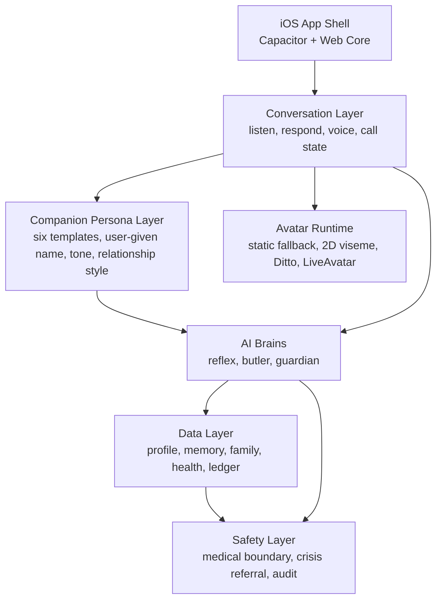

# Munea System Architecture

> Updated: 2026-06-29
> Scope: product and service architecture for the iOS-first Munea app.

## Product Position

Munea is an AI health-care companion app built around three product pillars:

1. AI health care.
2. Family interaction.
3. `聊聊` as the core daily relationship loop.

Family and older-adult care remain the first high-value market wedge, but Munea is not an elderly-only product. The app should support future expansion into broader family health, assisted living, clinics, pharmacies, and hardware-assisted services.

## User-Facing App Layers

| Layer | Purpose | Current State |
|---|---|---|
| Home | Daily greeting, reminders, quick entry into `聊聊` | Runnable prototype |
| 聊聊 | Fullscreen face, speech-to-speech voice, emotional companionship | Local Gemini chat/TTS demo + microphone bridge |
| Health Status | Health routines, Apple Health entry, trend summaries | Prototype UI |
| Family | Family view, encouragement, shared care loop | Prototype UI |
| Settings / Onboarding | Profile, avatar choice, family setup, device setup | Prototype UI |

The first-screen experience should lead with Munea as a living companion, not with an elderly-care label.

## Service Architecture

Munea is organized as four core layers:



## Three Brains

The "three brains" are product responsibility layers, not three fixed model names.
Munea should be able to change providers without changing the user journey or data model.

| Brain | Responsibility | Current implementation | Future provider direction |
|---|---|---|---|
| Reflex Brain | Real-time `聊聊` conversation: listen, respond, speak, interrupt, recover | Gemini generation + TTS demo through local endpoints | `MuneaVoiceProvider`, with Gemini Live / Interactions as first candidate |
| Butler Brain | Background care context: routines, family notes, daily prep, memory summaries | `MuneaBrainRouter` deterministic contract + local memory fallback | Claude Sonnet 5 first, effort profiles before cost fallback |
| Guardian Brain | Safety boundary: crisis language, abnormal routine signals, referral rules | Rules + `MuneaBrainRouter` deterministic risk contract | Claude Sonnet 5 + moderation/classifier support; rules keep priority |

Avatar is not one of the three brains. Ditto and LiveAvatar are face/rendering engines that consume conversation state and audio timing; they should not own health logic, memory, or medical/safety decisions.

## Companion Persona Layer

The companion persona layer sits between product identity and the three brains.

It controls how the selected companion expresses care, but it must not change facts, privacy boundaries, or Guardian safety policy.

```text
Final reply
  = companion persona
  + user memory
  + live perception
  + current conversation
  + safety rules
  + voice / avatar expression limits
```

Six templates are currently planned:

| Template | Role | Primary expression |
|---|---|---|
| `nening-real-female` | warm family companion | gentle, attentive, emotionally present |
| `companion-real-male` | calm brother / steady friend | grounded, practical, protective |
| `munea-2d-xiaoyun` | bright friend | light, curious, encouraging |
| `munea-2d-ayuan` | thoughtful friend | observant, reflective, tidy |
| `munea-2d-mimi` | playful small companion | cute, warm, lightly mischievous |
| `munea-2d-wangcai` | loyal guardian companion | steady, warm, simple |

Important split:

- `display_name` is what the user calls the companion.
- `template_id` is the selected face / voice / persona template.
- persona template is product-owned behavior.
- relationship state is user-specific growth over time.

Current contract:

- `POST /persona/context` returns the selected persona context pack.
- `docs/COMPANION-PERSONA-LAYER-v1.md` is the source of truth for persona composition.
- `companion_profiles.template_id` and `companion_profiles.display_name` remain separate.
- production relationship state should move into `companion_relationship_states` before App Store launch.

### Reflex Brain

Hot path for `聊聊`.

- Taiwan Mandarin first.
- English second.
- Taiwanese Hokkien remains research only.
- Current prototype uses Gemini generation + TTS.
- Target direction is a real-time voice loop behind a `MuneaVoiceProvider` adapter, with Gemini Live / Interactions as the first candidate rather than a hard-coded dependency.
- Current app contract exposes `window.MuneaVoiceProvider`; backend exposes `/voice-session` for capability metadata and future ephemeral real-time sessions.
- The product default is speech-to-speech: the call screen should feel like a video conversation. Do not surface a running transcript as the primary UI. Captions may exist later as an accessibility option, not as the default interaction model.

### Butler Brain

Background context layer.

- Prepares today: health routines, appointments, weather, family notes, reminders.
- Reads from profile, memory, family, and health data.
- Must not block the live conversation.
- Owns memory extraction, memory retrieval, care summaries, topic preparation, and family digest drafts.
- Uses effort profiles: `quick`, `standard`, `deep`.

### Guardian Brain

Safety and referral layer.

- Watches for crisis language, abnormal routine signals, and escalation needs.
- Refers to family or external help.
- Does not diagnose, prescribe, treat, or act as therapy.
- Has authority to interrupt or constrain Reflex responses when risk is high.
- Starts with deterministic rules, then can ask a classifier/model for ambiguous cases.

`docs/AI-SERVICE-DESIGN-v1.md` is the current source of truth for model selection, memory lifecycle, perception, Wisdom Lens, and Guardian policy details.

## One Face: Avatar Runtime

Avatar is now moved forward as a core architecture track, but it must be staged correctly.

Current runtime contract:

| State | Meaning | Current Fallback |
|---|---|---|
| `idle` | Present and breathing | Static image + CSS breathing/blink |
| `listening` | User is speaking | Listening cue |
| `thinking` | AI is preparing a response | Thinking cue |
| `speaking` | Munea is speaking | Wave cue + face motion |

This state contract is the insertion point for future engines:

1. Static CSS fallback.
2. 2D viseme / lightweight live face.
3. Ditto standard talking head.
4. LiveAvatar high-end engine if PoC proves viable.

Principle: conversation continuity beats face fidelity. If an avatar engine is slow or unavailable, Munea keeps talking and degrades the face gracefully.

## Companion Identity Model

Munea's companion is not a fixed character name.

Separate these concepts:

| Layer | Meaning | Example |
|---|---|---|
| `display_name` | User-chosen name shown in the app | 寧寧, 小安, 阿福 |
| `template_id` | Visual/personality/voice template selected by the user | warm-family, calm-brother, upbeat-friend |
| `backend_char` | Current prototype persona key used by the local engine | 寧寧, 阿宏, 小昀 |
| `avatar_asset` | Rendered face/body asset | `nening-real-female.png` |
| `voice_profile` | Voice and speaking style | Leda / Charon / etc. |

Rules:

- The user can rename the companion without changing its face, voice, or memory.
- Changing a template updates appearance, voice, and interaction style, but should not force a user-visible name change after the user has edited the name.
- Family members may later have their own relationship-specific nicknames for the same companion.
- Database design should store `display_name` and `template_id` separately in the companion profile.

Current prototype contract:

- `web/src/companion-profile.js` is the browser-side Companion Profile adapter and static-preview fallback.
- `engine/companion_profile.json` remains the legacy single-profile mirror for compatibility.
- `engine/app_profile_store.json` is the local account/family/person/companion store placeholder.
- `engine/billing_store.json` is the local subscription entitlement and usage ledger placeholder.
- `engine/privacy_requests.json` is the local data export / account deletion request ledger placeholder.
- `POST /companion-profile` loads or saves the same `templateId` / `displayName` shape.
- `POST /app-profile` loads the broader local store so account and family features can attach without changing the companion contract.
- `POST /entitlements` returns subscription state and feature gates.
- `POST /subscription-event` accepts local notification-shaped subscription events; production must verify Apple signed payloads before granting paid access.
- `POST /privacy-export` returns a local JSON export package for the account/family/profile/billing/privacy ledger.
- `POST /account-deletion` tracks the in-app account deletion request contract.
- `POST /ai/brain-status` returns the current AI brain model/service plan.
- `POST /memory/extract` extracts memory candidates without storing raw transcripts by default.
- `POST /memory/retrieve` retrieves local prototype memory by query.
- `POST /guardian/evaluate` returns Guardian risk level and response policy.
- Onboarding writes `templateId` and `displayName` before entering the app.
- Home, Chat, and Settings all read the same profile.
- Settings writes back to the same profile when the user renames the companion or changes templates.
- Static preview persistence uses `localStorage`; full app mode syncs to the local backend store. Production should move the same account/family/profile shape into the database.

## iOS Shell

Munea uses Capacitor so the web core can become an iOS app first, Android later.

Native responsibilities:

- Microphone permission and capture.
- Push notifications.
- Future HealthKit bridge.
- App Store packaging.
- Optional native audio bridge if WKWebView microphone capture is unstable.

## Data Layer

The local JSON demo now has two layers:

- `companion_profile.json`: compatibility mirror for the current prototype route.
- `app_profile_store.json`: account, family group, primary person, and companion profile store.

This is still not production storage. It exists so the product model can stabilize before the database move.

Recommended first production path: Postgres with row-level tenant isolation.

Minimum tables / collections:

- user profile.
- companion profile.
- family group.
- memory items.
- transcript references.
- health data snapshots.
- safety events.
- subscription / usage ledger.
- audit events.

Every production API must carry a tenant scope such as `family_group_id` and user/person scope. Cross-family memory leakage is a P0 failure.

Payment and premium feature access must be server-authoritative. The frontend can start or restore purchases, but `/entitlements` and the backend subscription ledger decide paid status, family limits, premium Avatar access, and usage balances.

Data export and account deletion must also be server-authoritative. The app may present the UI, but production deletion/export jobs must run behind authenticated backend workflows with audit logs and retention rules.

Current Supabase setup:

- `supabase/sql/001_initial_munea_schema.sql` defines the first production table and RLS draft.
- `docs/supabase/SETUP.md` documents dashboard setup and post-SQL verification.
- `docs/supabase/munea-env.example.txt` lists required environment variables.
- The schema is SQL Editor-ready; it is not yet applied to a live project from this environment because Supabase CLI/MCP auth is not currently available here.

## Development Order

The updated order is:

1. Stabilize the runnable prototype and smoke tests.
2. Define product/service architecture and runtime contracts.
3. Move Avatar Runtime forward with state-driven fallback.
4. Validate iOS microphone and app shell.
5. Build the real-time voice loop.
6. Attach the selected avatar engine to the already-defined runtime.
7. Replace local JSON with scoped data storage.

This brings avatar development forward without betting the product on an unproven GPU path.
