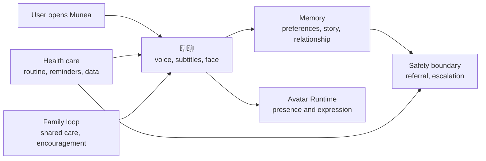

# Munea Product Architecture And Avatar-First Plan

> Updated: 2026-06-29
> Purpose: move product architecture and real-time Avatar development earlier without creating GPU-driven waste.

## Decision

Move two tracks forward immediately:

1. Product architecture and feature contracts.
2. Real-time Avatar development process.

This does not mean building full LiveAvatar first. It means the product and code should now assume there is an Avatar Runtime layer, so the app can later switch from static fallback to 2D viseme, Ditto, or LiveAvatar without rewriting `聊聊`.

## Product Architecture Spine

## Feature Modules

| Module | v1 Role | Development Status |
|---|---|---|
| `聊聊` | Main relationship loop | In prototype, connected to local Gemini chat/TTS |
| Voice input | User speaks to Munea | Microphone fallback bridge added; iPhone test pending |
| Avatar Runtime | Face state and future engine insertion point | Added as frontend runtime contract |
| Family loop | Companion-to-family feedback | Prototype UI |
| Health routine | Reminders and health context | Prototype UI |
| Memory | Personal continuity | Local JSON only |
| Safety | Non-medical boundary and referral | Spec level, not production service |
| iOS shell | App Store path | Capacitor scaffold ready; Xcode pending |

## Avatar Development Moved Forward

### Track A: Runtime Contract

Status: active.

The frontend now has `MuneaAvatarRuntime` with:

- `setState(state)`
- `setCharacter(name, avatarId)`
- `setMode(mode)`
- `setViseme(shape)`
- `speak(text, audioMs)`
- `onAudioEnd()`

This is the shared contract for static fallback, 2D viseme, Ditto, and LiveAvatar.

The runtime now also consumes the backend `/avatar-session` decision when Chat opens. The backend is responsible for choosing the allowed mode, applying premium fallback, and recording premium Avatar usage; the frontend renders the selected mode and keeps the S2S conversation alive.

### Track B: Fallback Experience

Status: active.

Current fallback:

- static face image.
- breathing / blink motion.
- listening / thinking / speaking cues.
- subtitle-first experience.

This must remain production-grade because it is the safety net when GPU avatar is unavailable.

### Track C: 2D Viseme PoC

Status: first local layer added.

Goal:

- prove the face can react to phoneme/viseme or audio amplitude locally.
- avoid GPU dependency for first TestFlight.
- keep cost near zero per additional user.

Deliverable:

- one selected avatar with mouth states or lightweight motion states.
- driven by audio playback state or generated timing.
- measured on mobile Safari / WKWebView.

Current implementation:

- Engine modes exist: `static-css`, `2d-viseme`, `ditto`, `liveavatar`.
- 2D avatar choices automatically use `2d-viseme`.
- Photoreal choices remain on `static-css` unless `?avatar=2d`, `?avatar=ditto`, or `?avatar=liveavatar` is used for development testing.
- The first mock mouth layer cycles through `rest`, `open`, `wide`, `round`, and `smile` while speaking.
- Backend `/avatar-session` selects the allowed runtime mode, falls back to `2d-viseme` when premium Avatar entitlement or minutes are unavailable, and records premium Avatar minute usage.
- Frontend Chat startup calls `/avatar-session` before opening the voice session, applies `selectedMode`, and exposes `?debug=avatar` diagnostics for local verification.

### Track D: Ditto / LiveAvatar PoC

Status: GPU-dependent.

Goal:

- run a real-time or near-real-time talking-head path.
- measure first-frame latency, fps, cold start, and cost.

Constraint:

- do not block the app shell or voice loop on this path.
- do not promise full LiveAvatar until PoC numbers are real.

## Revised Sprint Order

### Sprint A: Architecture Spine

- [x] Update system architecture to current product direction.
- [x] Add product architecture + Avatar-first plan.
- [x] Add frontend Avatar Runtime abstraction.
- [x] Add smoke coverage for JS syntax.

### Sprint B: Avatar Runtime MVP

- [x] Add visible runtime diagnostics in development mode.
- [x] Add avatar engine mode enum: `static-css`, `2d-viseme`, `ditto`, `liveavatar`.
- [x] Add a mock avatar engine that consumes audio duration and state events.
- [x] Add first 2D mouth-state layer.
- [x] Add backend entitlement gate for Avatar runtime mode selection.
- [x] Connect frontend runtime to backend Avatar session decisions.
- [x] Add mobile visual QA checklist for idle/listen/think/speak.

### Sprint C: 2D Viseme Prototype

- [ ] Choose one avatar for first viseme PoC.
- [ ] Define 5-8 mouth shapes or motion states.
- [ ] Drive mouth motion from audio amplitude or response timing.
- [ ] Test on iPhone.

### Sprint D: Voice Loop

- [ ] Complete iOS microphone device test.
- [ ] Connect real-time voice or STT -> chat -> TTS loop.
- [ ] Feed audio timing into Avatar Runtime.

### Sprint E: GPU Avatar PoC

- [ ] Re-run Ditto optimized fps test.
- [ ] Run LiveAvatar cold-start / fps test if resources are available.
- [ ] Decide what ships in TestFlight: static/2D, Ditto, or hybrid.

## Product Management Read

Moving avatar forward is strategically right because Munea's promise is not just "AI replies." It is the feeling that a caring presence is there.

Engineering guardrail:

Avatar becomes an early product layer, not an early GPU dependency.

That keeps the product emotionally differentiated while still protecting schedule, margin, and App Store readiness.
